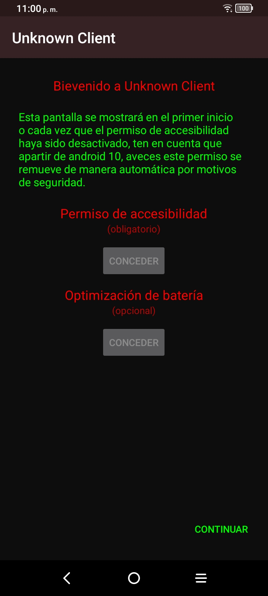
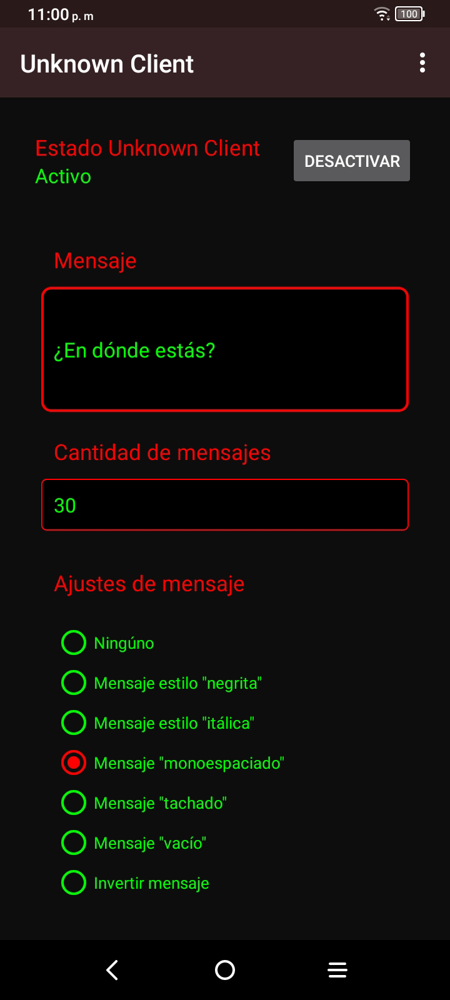
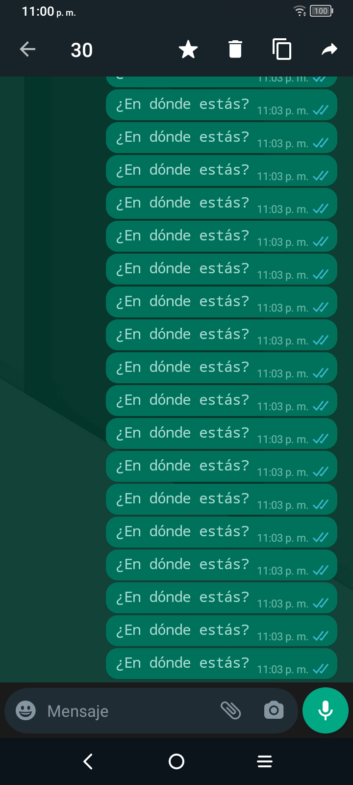

# Unknown Client

Unknown Client es un proyecto de código abierto desarrollado a fines de 2014. Tiene como finalidad la de enviar de manera automática una determinada cantidad de mensajes establecidos por el usuario a contactos o grupos de WhatsApp.

# README Translation
- [Español](README.md)
- [English](com/unknown60/metadata/android/en-rUs/README.md)

-839192?style=plastic&logo=android&logoColor=green)

### Características
- Liviana: No se usa abundancia de recursos o vectores para conservar el tamaño reducido.
- Rendimiento: Se evitó usar dependencias o librerías innecesarias para no gastar memoria a la hora de la ejecución.
- Segura: Requiere únicamente de 1 permiso de accesibilidad.

<h3 style="display: inline">Screenshots</h3>

### Acerca de

**Unknown Client** es un proyecto de código abierto desarrollado a fines de **2014**. En el comienzo de su desarrollo fue un proyecto de código cerrado, y al optar por que sea una aplicación de tamaño reducido, se omitió la **obfuscación** de recursos. Haciendo que personas malintencionadas **roben** parte de la lógica del código de **Unknown Client**.

Gracias a esto, como desarrollador, **perdí las ganas** de continuar con el proyecto.

A día de hoy, al ver que las aplicaciones con el código robado tienen escasez en funciones, no cuentan con soporte para nuevas versiónes de android y que además están repleta de errores, decidí liberar el código.

### Descargas

Por el momento puedes descargar el proyecto en compilado y firmado desde github.

### Creditos

Desarrollado por **Unknown-60**. 
2014 - 2021.

### Contacto

Puedes ponerte en contacto conmigo en [LosQueAtacan@protonmail.com](mailto:losqueatacan@protonmail.com).
Sientete libre de enviar tu duda, sugerencia o temas relacionados.
Estaré encantado de responder todo tipo de mensajes. Ten por hecho que ignoraré los mensajes vulgares, dañinos o que inciten al odio.

##### Mensaje a desconocido.
 Aunque ya no estés más conmigo, sigo programando para llenar el vacío, aunque nada tenga sentido y no me lleve a ningúna parte. Te extraño.

### Licencia

> Unknown-Client (c) 2023 Unknown-60
> 
> This is free software: you can redistribute it and/or modify it under the terms of the GNU General Public License as published by the Free Software Foundation, either version 3 of the License, or (at your option) any later version.
> 
> This software is distributed in the hope that it will be useful, but WITHOUT ANY WARRANTY; without even the implied warranty of MERCHANTABILITY or FITNESS FOR A PARTICULAR PURPOSE. See the GNU General Public License for more details.
> 
> You should have received a copy of the GNU General Public License along with this app. If not, see https://www.gnu.org/licenses/.
