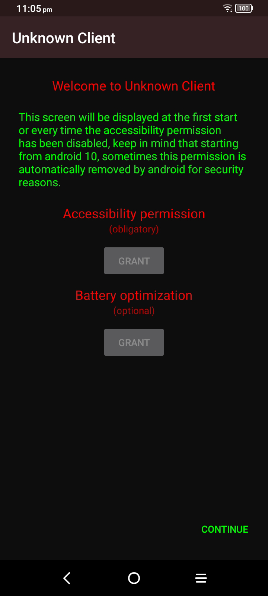
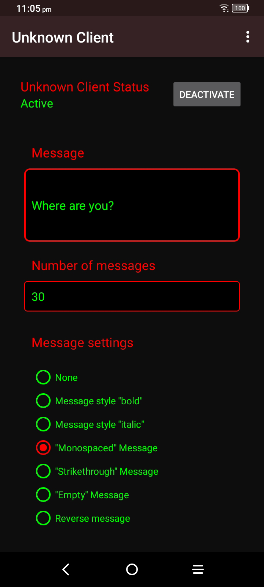
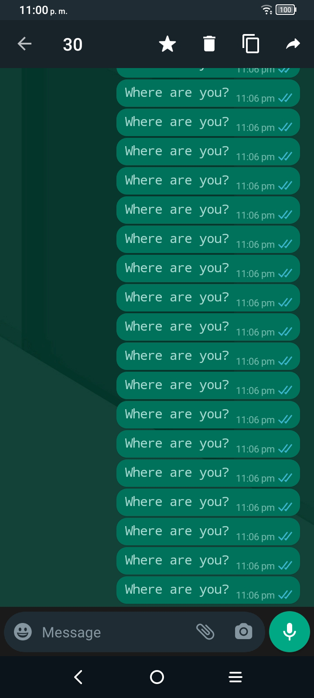

# Unknown Client

Unknown Client is an open source project developed at the end of 2014. Its purpose is to automatically send a certain number of messages established by the user to WhatsApp contacts or groups.

# README Translation
- [Español](README.md)
- [English](com/unknown60/metadata/android/en-rUs/README.md)

-839192?style=plastic&logo=android&logoColor=green)

### Features
- Lightweight: No abundance of resources or factors is used to keep the small size.
- Performance: The use of unnecessary dependencies or libraries was avoided so as not to waste memory at execution time.
- Secure: Requires only 1 accessibility permission.

<h3 style="display: inline">Screenshots</h3>

### About

**Unknown Client** It's an open source project developed at the end of **2014**. At the beginning of its development it was a closed source project, and by choosing to make it a small size application, the **obfuscation** of resources was omitted. Making malicious people **steal** part of the Unknown Client code logic.

Thanks to this, as a developer, **I lost the desire** to continue with the project.

To this day, seeing that the applications with the stolen code have few functions, do not have support for new versions of android and that they are also full of errors, I decided to update and publish the source code.

### Downloads

At the moment you can download the compiled and signed project from github.

### Credits

Developed by **Unknown-60**. 
2014 - 2021.

### Contact

You can contact me at [LosQueAtacan@protonmail.com](mailto:losqueatacan@protonmail.com).
Feel free to send your questions, suggestions or related topics.
I will be happy to answer all kinds of messages.  Please know that I will ignore vulgar, harmful or hateful messages.

##### Message to unknown.
 Even if you're no longer with me, I keep programming to fill the void, even if nothing makes sense and doesn't get me anywhere. I miss you.

### License

> Unknown-Client (c) 2023 Unknown-60
> 
> This is free software: you can redistribute it and/or modify it under the terms of the GNU General Public License as published by the Free Software Foundation, either version 3 of the License, or (at your option) any later version.
> 
> This software is distributed in the hope that it will be useful, but WITHOUT ANY WARRANTY; without even the implied warranty of MERCHANTABILITY or FITNESS FOR A PARTICULAR PURPOSE. See the GNU General Public License for more details.
> 
> You should have received a copy of the GNU General Public License along with this app. If not, see https://www.gnu.org/licenses/.

